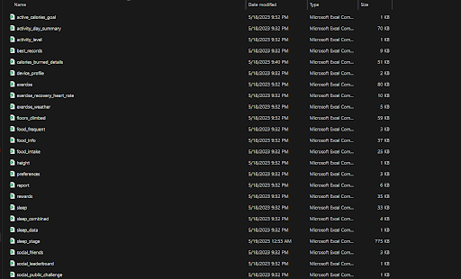

# Physical-Health
This is a project that tracked the activity levels of an individual from Jan 2023 to Apr 2023.
- Downloaded personal dataset from Samsung Health
- Eliminate the first row to enable auto schema detection using Python
- Formatted files name using Python (pandas)

BEFORE 

AFTER

- Had to clean data using Python before importing it to BigQuery. 
- Imported dataset into BigQuery to perform SQL operations
- Import Wyze dataset and joined to Myhealth table
