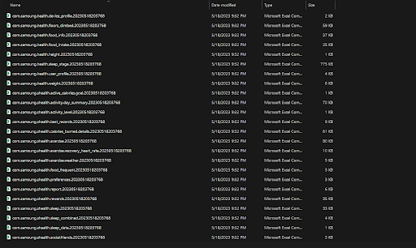
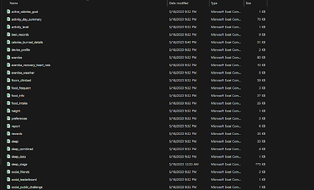

# Physical-Health
This is a project that tracked the activity levels of an individual from Jan 2023 to Apr 2023. I used SQL and Python to extract and clean the data.  I then imported the results into Tableau to leverage its strong visualization tools. Please take a look at my Tableau Project:

>[Activity Levels and Physical Health](https://public.tableau.com/app/profile/bethania.pena/viz/ActivityLevelsandPhysicalHealth/Dashboard1)

- Extracted and consolidated data from Samsung Health and Wyze sources, ensuring data integrity and quality for analysis
- Employed Python to efficiently format the extracted data, facilitating seamless auto-schema detection in BigQuery

>BEFORE 

>AFTER

- Utilized BigQuery to import the prepared data, enabling robust SQL operations and queries for in-depth analysis
- Transferred SQL results to Tableau, leveraging its visualization capabilities to create impactful and visually appealing representations of data
- Designed and delivered 11+ dynamic visualizations, effectively tracking key metrics and presenting complex information in an easily understandable format
- Enhanced the user experience by incorporating interactive features such as Actions and Filters into the Tableau dashboard, enabling users to explore and interact with the data more effectively